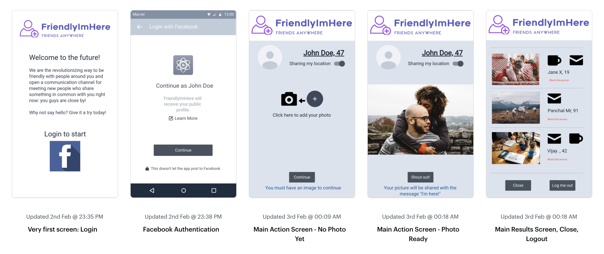

# Friendly
    "I am here". This is the original subtitle.

React and Node monorepo. Lerna. Storybook. Jest for testing with ["update here once CI/(GH Actions) is configured"]() coverage.

## TODO
- Start writing component features with tests first (red/green)
    - Do we have istambul test coverage already included and configured in Jest (CRA version)
    - Add husky/similar to check TS support and prettier/eslint stuff on commits
        - Should not take long. Run only affected files. If takes too long, consider moving to pre-push instead.
        - Should run tests before pushing the branch
## Storybook components
- Button
- Link
- Text input

## Early notes regarding features

The app has a whole bunch of features, but in other to save some time the main API are:
- This will speed up the tests with profiles of fake users for illustrative purposes - https://randomuser.me/
- This will speed up the retrieval of login information to actually display custom user data - https://developers.facebook.com/docs/facebook-login/web
- Taking a photo with the browser - https://developer.mozilla.org/en-US/docs/Web/API/WebRTC_API/Taking_still_photos

Finally a more advanced feature would be to enable communication with nearby users:
- To check users that are nearby, a google maps feature is required - https://developers.google.com/maps/documentation/distance-matrix/start
- To allow users to communicate with each other using our platform, I am not sure but I guess Node is required - https://socket.io/get-started/chat/

## Future topics
- Enable Storybook components to be sourced to a main micro-app
